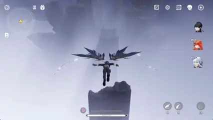

# DX11 Wuthering Waves

<h3>📅 개발 기간 : 2개월 &nbsp;&nbsp;</h3>
<h3>👥 개발 인원 : 7명</h3>

  

# 게임 플레이 하이라이트

<table>
  <tr>
    <td align="center" width="50%">
      <h3>레비아탄 컷씬</h3>
      
    </td>
    <td align="center" width="50%">
      <h3>레비아탄 전투 (QTE)</h3>
      
    </td>
  </tr>
  <tr>
    <td align="center" width="50%">
      <h3>코로사우로스 전투</h3>
      
    </td>
    <td align="center" width="50%">
      <h3>거짓된 신왕 전투</h3>
      
    </td>
  </tr>
  <tr>
    <td align="center" width="50%">
      <h3>로그인 화면 </h3>
      
    </td>
    <td align="center" width="50%">
      <h3>갓 레이</h3>
      
    </td>
  </tr>
  
</table>

 

# 구현 요약

 

# 사용한 기술

 

## 👥 팀원 목록

| 이름 | 역할 | 설명 |
| :---: | :--- | :--- |
| **박지호(팀장)** | **MainFramework** | 메인 프레임워크, 카메라, 최적화, 레벨 디자인, 천국 맵 배치|
| **김정훈** | **Shader** | 디퍼드 렌더링 파이프라인, SFX |
| **노영훈** | **Player / Animation** | 플레이어 상태 제어, 애니메이션 제어 |
| **임은비** | **Effects** | 전투 및 환경 Effect |
| **이진호** | **AI / Monster** | 몬스터 전투 AI, NPC |
| **김기훈** | **UI System** | UI 인터페이스, 미니게임, 스크립트 |
| **신우혁** | **Map** | 맵 에디터, 1Stage 배치 |

